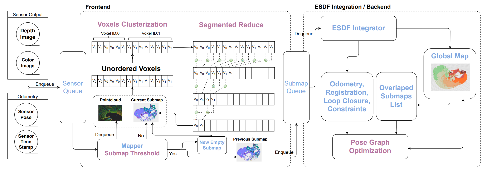

coVoxSLAM

GPU-accelerated volumetric SLAM system for globally consistent maps for small and large-scale environments.

## Table of Contents
- [Table of Contents](#table-of-contents)
- [coVoxSLAM](#covoxslam)
- [Get Started ](#get-started-)
- [Compilers ](#compilers-)
- [Dependencies ](#dependencies-)
- [Build](#build)
- [Paper](#paper)

## coVoxSLAM


The architecture of coVoxSLAM is shown above. The system consists of a frontend and backend. The frontend is responsible for integrating the incoming sensor data into a TSDF volume to include or update the voxels that build the TSDF maps and propagate updated voxels from the TSDF to the ESDF submaps. The created voxels are grouped in fixed-size blocks, which in turn, are indexed using an appropriately designed hash table. The backend is responsible for estimating the most likely submap collection alignment by minimizing the total error of the three pose graph constraints: odometry, loop closure and submap registration.

## Get Started <a id='getstarted'></a>

coVoxSLAM includes two components: a CPU version and a GPU version. Each can be built and run independently using the provided flags (--cpu for the CPU version and --gpu for the GPU version). By default, the build process will include both versions.


## Compilers <a id='compilers'></a>

To build coVoxSLAM you need a compiler capable of C++20. It has been tested on:

    GCC 11 and above on Linux
    Clang 15 and above on Linux
    MSVC 2019 and above on Windows

## Dependencies <a id='deps'></a>

Dependencies are managed by CMake

- Ceres (only for the CPU version)
- CUDA 12 (only for the GPU version)

## Build

```
mkdir build
cd build
cmake .
```

## Paper

Soon